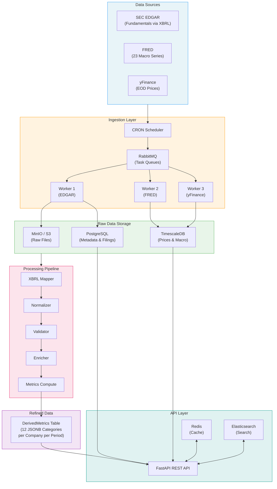
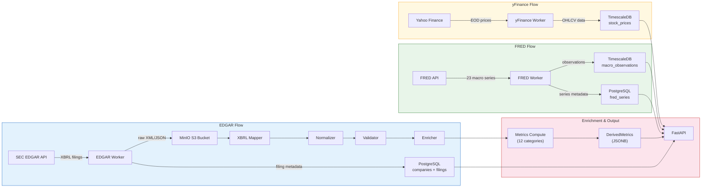
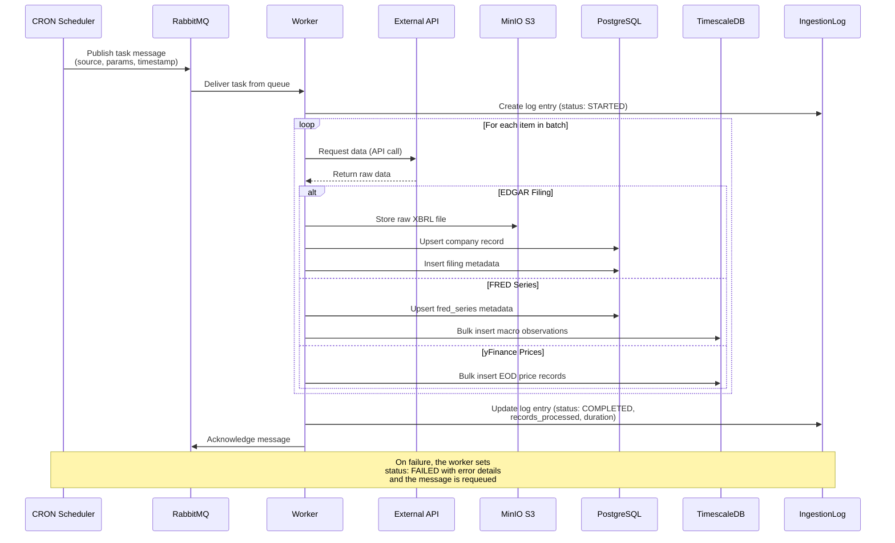
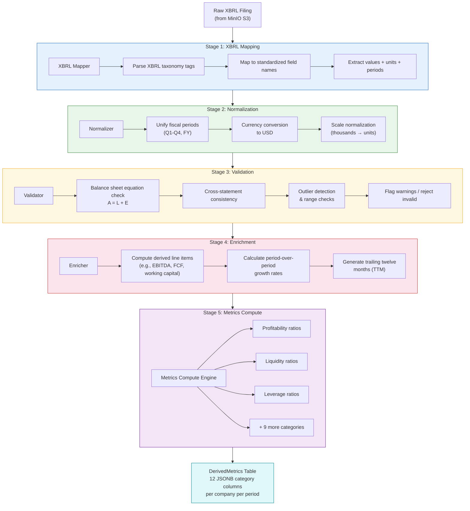
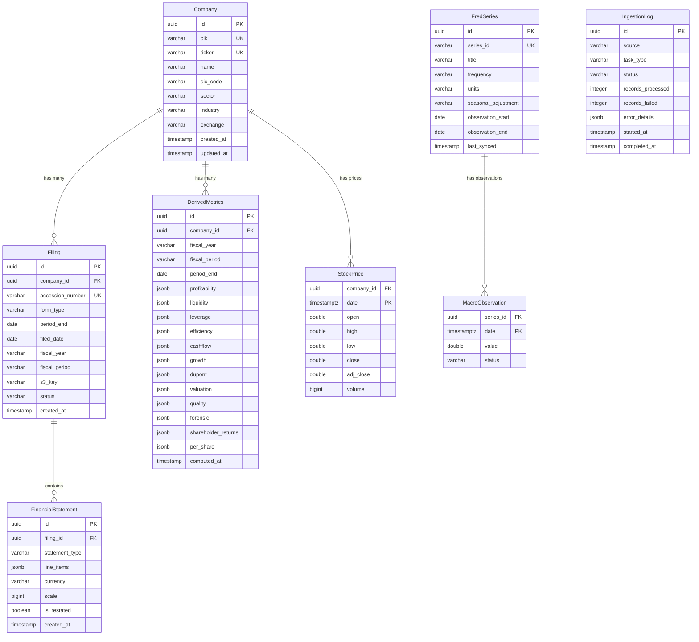
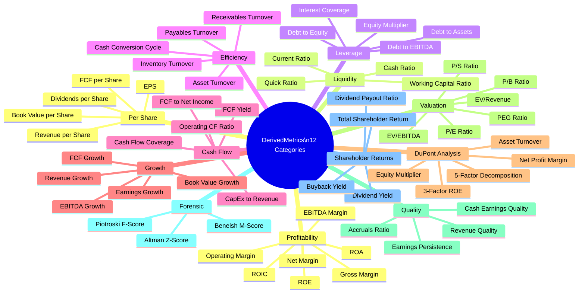
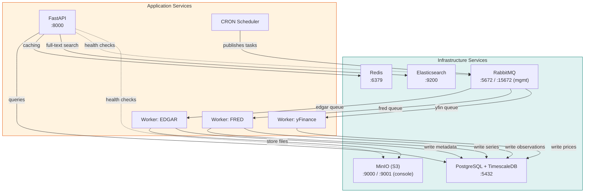
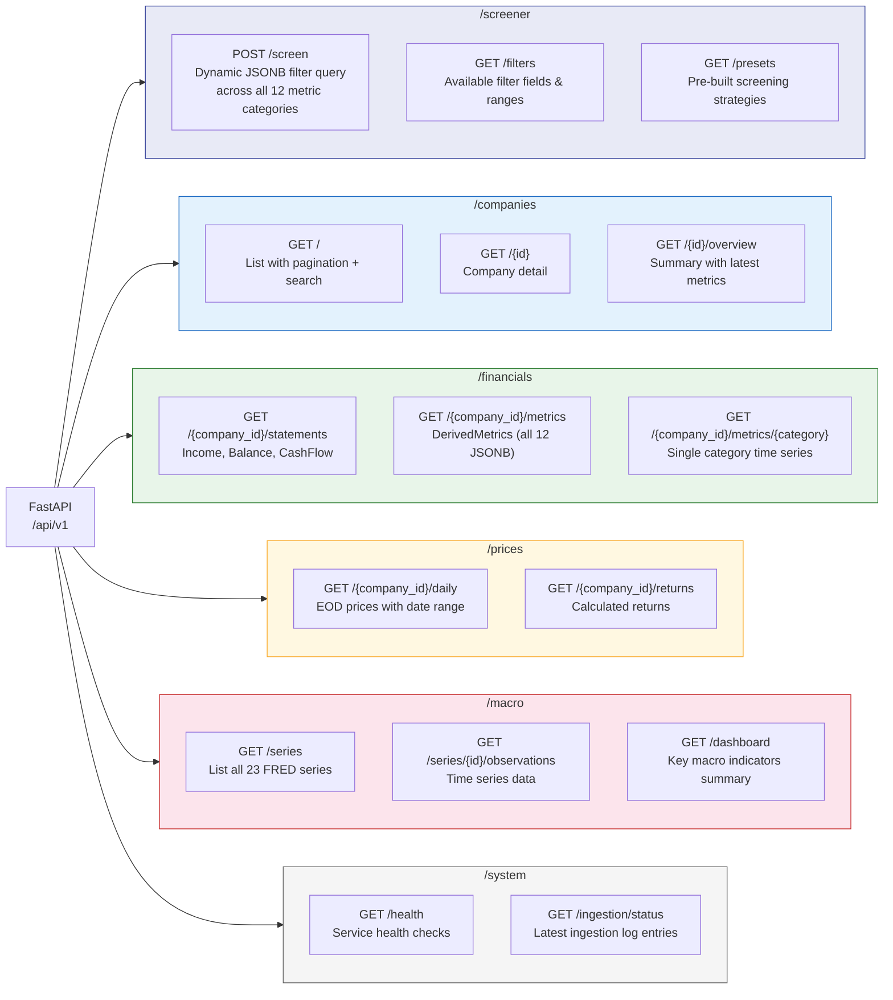

# Excella Financial Data Platform — Architecture Documentation

This document provides a comprehensive visual guide to the Excella platform architecture using Mermaid diagrams. Excella is a screener.in-style financial data platform that ingests data from SEC EDGAR, FRED, and yFinance, processes it through a normalization and enrichment pipeline, and exposes it via a FastAPI REST API with dynamic screener capabilities.

---

## 1. System Architecture

A high-level overview of the entire platform, showing how data flows from external sources through ingestion, storage, processing, and finally to the API layer.

---

## 2. Data Flow

A detailed left-to-right flow showing how each data source is processed independently before converging in the enrichment pipeline and API.

---

## 3. Ingestion Sequence

A sequence diagram showing the interaction pattern when the CRON scheduler triggers an ingestion job. This pattern is the same for all three workers, though the external API and storage targets differ.

---

## 4. Pipeline Processing

The data enrichment pipeline that transforms raw EDGAR filings into normalized, validated, and enriched financial metrics stored as JSONB in the DerivedMetrics table.

---

## 5. Database Schema

An entity-relationship diagram showing the core tables, their columns, and how they relate. Hypertables (TimescaleDB) are noted for time-series data.

> **Note:** `StockPrice` and `MacroObservation` are TimescaleDB hypertables partitioned by date for efficient time-range queries. All other tables reside in standard PostgreSQL.

---

## 6. Metrics Taxonomy

A mind map showing all 12 metric categories and the individual metrics computed within each.

---

## 7. Docker Services

All containers in the Docker Compose stack and how they connect. Arrows indicate dependency or communication direction.

---

## 8. API Routes

All FastAPI endpoint groups and their key routes. The screener endpoint supports dynamic JSONB filtering across all 12 metric categories.

---

## 9. Scheduler Timeline

The daily CRON schedule for all automated tasks. Times are in UTC. Each job publishes messages to RabbitMQ which are then consumed by the appropriate worker.

```mermaid
gantt
    title Daily Ingestion & Processing Schedule (UTC)
    dateFormat HH:mm
    axisFormat %H:%M

    section EDGAR
    SEC EDGAR Filing Sync           :edgar, 06:00, 60min

    section FRED
    FRED Macro Series Sync          :fred, 07:00, 30min

    section yFinance
    EOD Price Ingestion             :yfin, 18:00, 45min

    section Pipeline
    Enrichment & Metrics Compute    :pipe, 20:00, 90min
```

**Schedule details:**

| Time (UTC) | Job | Description |
|---|---|---|
| 06:00 | EDGAR Sync | Fetch new/amended SEC filings via EDGAR XBRL API. Stores raw files in S3, metadata in PostgreSQL. |
| 07:00 | FRED Sync | Update all 23 macro series with latest observations. Writes to TimescaleDB hypertable. |
| 18:00 | yFinance Sync | Pull end-of-day OHLCV prices after US market close. Writes to TimescaleDB hypertable. |
| 20:00 | Pipeline Run | Process any new/updated filings through the full pipeline (XBRL Mapper, Normalizer, Validator, Enricher, Metrics Compute). Updates DerivedMetrics JSONB. |

---

## Summary

The Excella platform follows a classic ETL architecture adapted for financial data:

1. **Extract** — Three specialized workers pull data from SEC EDGAR, FRED, and Yahoo Finance on a daily schedule via RabbitMQ task queues.
2. **Transform** — A four-stage pipeline (Map, Normalize, Validate, Enrich) converts raw XBRL filings into standardized financial data, then computes 12 categories of derived metrics.
3. **Load** — Results are stored in PostgreSQL (relational data), TimescaleDB (time-series), and MinIO/S3 (raw files), with Redis for caching and Elasticsearch for search.
4. **Serve** — A FastAPI REST API exposes all data with a dynamic screener that filters across JSONB metric columns, enabling screener.in-style financial analysis.
