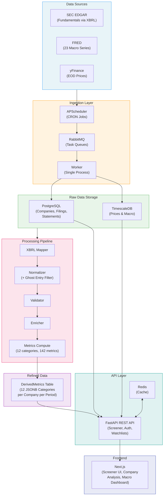
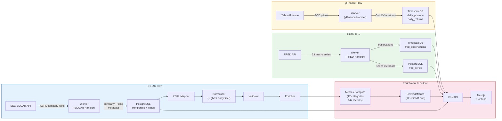
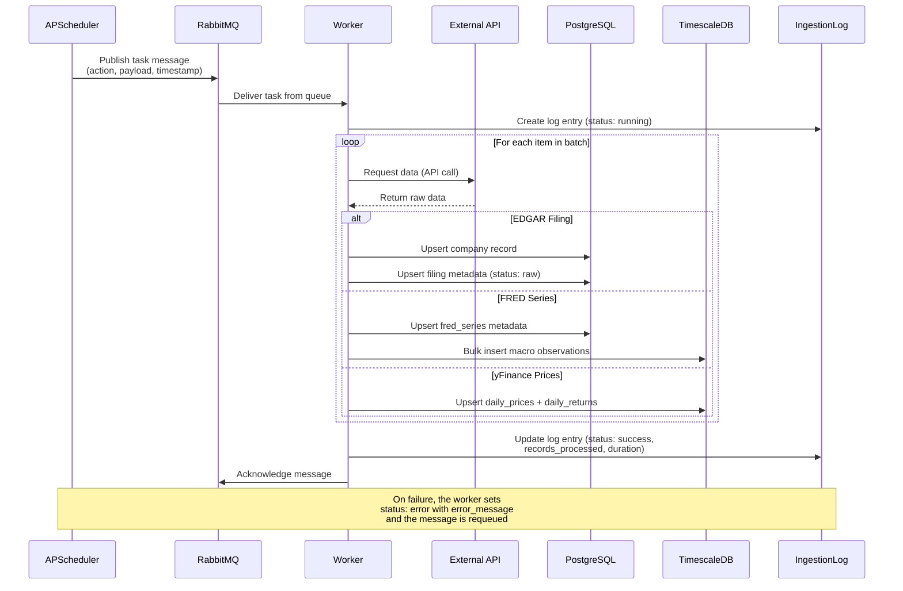
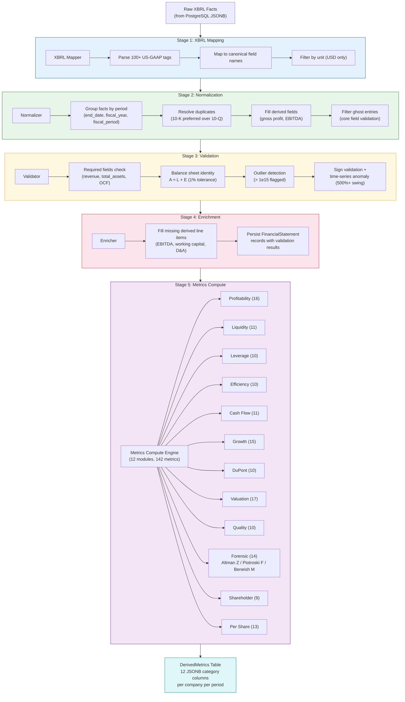
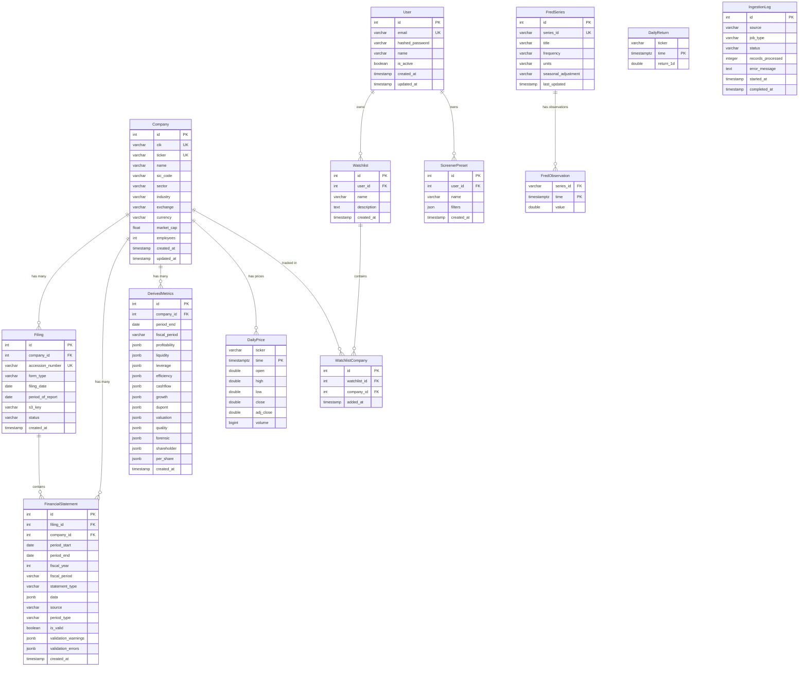
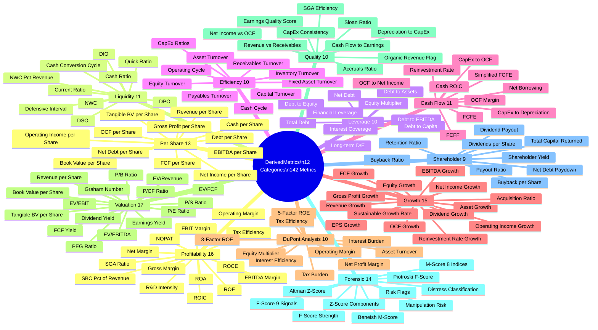
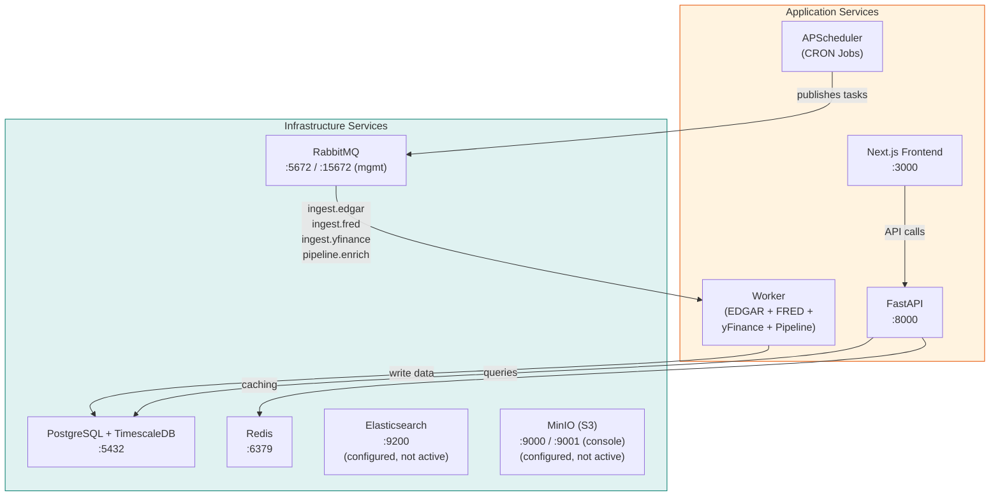
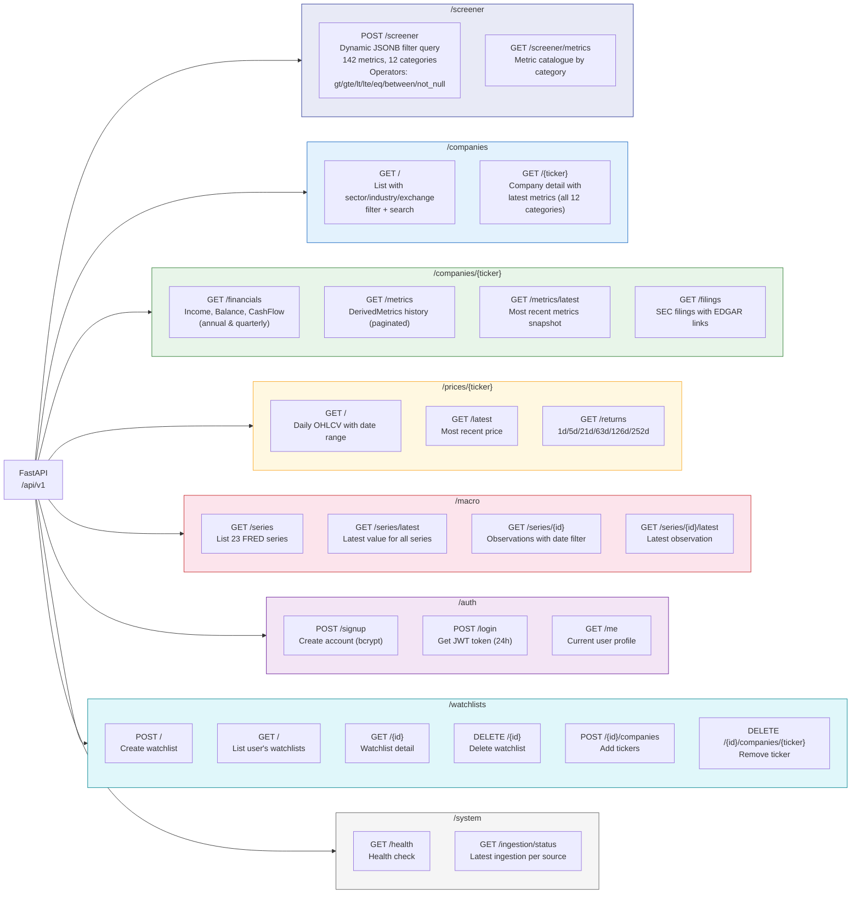
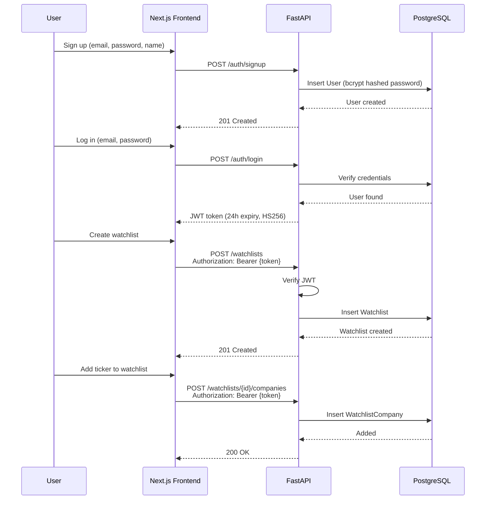

# Excella Financial Data Platform — Architecture Documentation

This document provides a comprehensive visual guide to the Excella platform architecture using Mermaid diagrams. Excella is a screener.in-style financial data platform that ingests data from SEC EDGAR, FRED, and yFinance, processes it through a normalization and enrichment pipeline, and exposes it via a FastAPI REST API with dynamic screener capabilities and a Next.js frontend.

---

## 1. System Architecture

A high-level overview of the entire platform, showing how data flows from external sources through ingestion, storage, processing, and finally to the API layer and frontend.

---

## 2. Data Flow

A detailed left-to-right flow showing how each data source is processed independently before converging in the enrichment pipeline and API.

---

## 3. Ingestion Sequence

A sequence diagram showing the interaction pattern when the CRON scheduler triggers an ingestion job. The single worker process routes messages to the appropriate handler based on queue name.

---

## 4. Pipeline Processing

The data enrichment pipeline that transforms raw EDGAR XBRL data into normalized, validated, and enriched financial metrics stored as JSONB in the DerivedMetrics table.

---

## 5. Database Schema

An entity-relationship diagram showing the core tables, their columns, and how they relate. Hypertables (TimescaleDB) are noted for time-series data.

> **Note:** `DailyPrice`, `DailyReturn`, and `FredObservation` are TimescaleDB hypertables partitioned by time for efficient time-range queries. All other tables reside in standard PostgreSQL.

---

## 6. Metrics Taxonomy

A mind map showing all 12 metric categories and the individual metrics computed within each.

---

## 7. Docker Services

All containers in the Docker Compose stack and how they connect. The single worker process consumes from all RabbitMQ queues and routes to appropriate handlers.

---

## 8. API Routes

All FastAPI endpoint groups and their key routes. The screener endpoint supports dynamic JSONB filtering across all 12 metric categories.

---

## 9. Scheduler Timeline

The daily CRON schedule for all automated tasks. Times are in US/Eastern. Each job publishes messages to RabbitMQ which are then consumed by the worker.

```mermaid
gantt
    title Daily Ingestion & Processing Schedule (US/Eastern)
    dateFormat HH:mm
    axisFormat %H:%M

    section EDGAR
    SEC EDGAR Filing Sync           :edgar, 06:00, 60min

    section FRED
    FRED Macro Series Sync          :fred, 07:00, 30min

    section yFinance
    EOD Price Ingestion             :yfin, 18:00, 45min

    section Pipeline
    Enrichment & Metrics Compute    :pipe, 20:00, 90min
```

**Schedule details:**

| Time (ET) | Job | Queue | Description |
|---|---|---|---|
| 06:00 | EDGAR Sync | `ingest.edgar` | Fetch recent SEC filings via EDGAR XBRL companyfacts API. Stores company + filing metadata in PostgreSQL. |
| 07:00 | FRED Sync | `ingest.fred` | Update all 23 macro series with latest observations. Writes to TimescaleDB hypertable. |
| 18:00 | yFinance Sync | `ingest.yfinance` | Pull end-of-day OHLCV prices after US market close. Writes to TimescaleDB hypertable. |
| 20:00 | Pipeline Run | `pipeline.enrich` | Process filings through normalize → validate → enrich → compute metrics. Updates DerivedMetrics JSONB. |

---

## 10. Auth & User Flow

Sequence diagram showing the JWT authentication flow and how protected resources (watchlists) are accessed.

---

## Summary

The Excella platform follows a classic ETL architecture adapted for financial data:

1. **Extract** — A single worker process consumes from four RabbitMQ queues to pull data from SEC EDGAR, FRED, and Yahoo Finance on a daily US/Eastern schedule.
2. **Transform** — A five-stage pipeline (Map, Normalize, Validate, Enrich, Compute) converts raw XBRL filings into standardized financial data, filters ghost entries, validates quality, and computes 142 metrics across 12 categories.
3. **Load** — Results are stored in PostgreSQL (relational + JSONB), TimescaleDB (time-series), with Redis for API caching.
4. **Serve** — A FastAPI REST API exposes all data with a dynamic screener, JWT auth, watchlists, and comprehensive financial data endpoints. A Next.js frontend provides interactive screener UI, company analysis, peer comparison, macro dashboards, and user watchlists.
